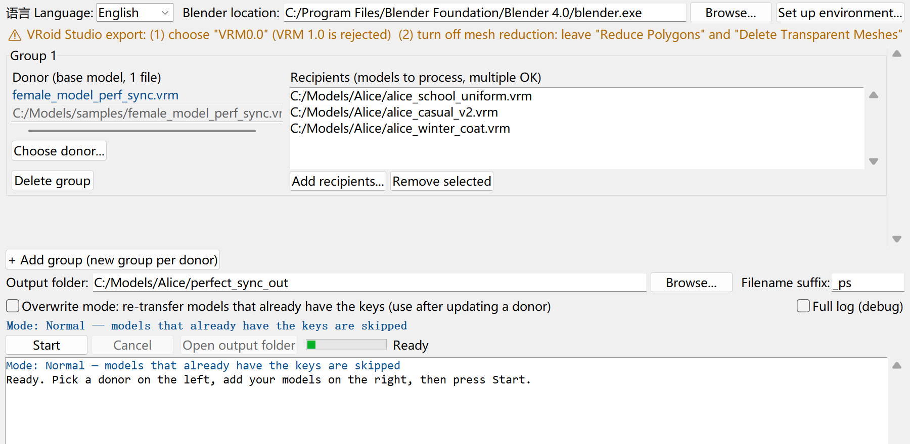
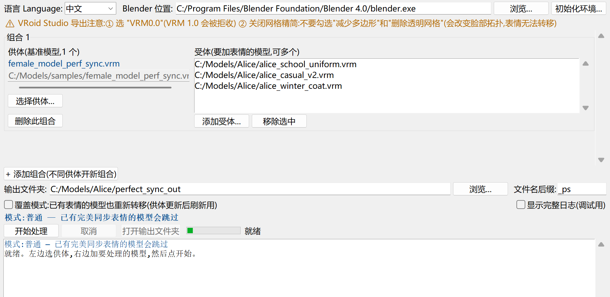

<!-- Language nav -->
**English** | [简体中文](#中文说明)

# blender-vrm-perfect-sync

**Add iPhone/ARKit "perfect sync" (52 blendshapes) to your VRoid VRM models — in batch, with a click-to-run app. No Blender skills required.**

VRoid Studio exports don't include the 52 ARKit expression shapes that face-tracking apps (Warudo, VNyan, VRM Posing Desktop, VSeeFace…) use for perfect sync. This tool copies a finished perfect-sync setup from **one donor model** onto **any number of your other VRoid models** automatically, because every official VRoid face shares the same mesh topology — the expression shapes transfer vertex-for-vertex, with zero manual sculpting.

> Windows only. Works fully offline once set up. Your original files are never modified — results are written as new `*_ps.vrm` files.

---

## ✨ What you get

- **One-click app** (`Perfect-Sync.bat`) with a friendly window — pick a donor on the left, drop your models on the right, press Start.
- **Batch processing** with multiple donor/recipient groups (one donor per character, many versions each).
- **First-run wizard** that checks for and can auto-download everything you need (Blender + VRM add-on).
- **Bilingual UI** (English / 简体中文), high-DPI aware.
- **Safe**: existing keys are skipped by default; a verify step confirms every clip binding transferred correctly.
- **Power-user CLI** underneath the GUI — see [docs/CLI.md](docs/CLI.md).

---

## 🚀 Quick start

1. **Download from the [Releases page](https://github.com/elainyilanchen/blender-vrm-perfect-sync/releases)** — pick one:

   | | Which file | Size | For whom |
   |---|---|---|---|
   | **Full** (recommended) | `…full-win64.zip` | ~450 MB | **Everything bundled** (Python + Blender + VRM add-on, ready to run offline). Best for first-timers, or if downloads keep failing on your network. |
   | **Lite** | `…lite-win64.zip` | ~45 MB | Tool + sample donors only. Missing pieces are downloaded on demand (needs internet), or your existing Python/Blender are used. |

2. **Unzip to a short path** such as `C:\vrm-tool` — avoid deep folders (e.g. WeChat's download folder); Windows breaks on paths over 260 characters. Then **double-click `Perfect-Sync.bat`**.
   - Can't read this file? Plain-text guides are inside: `README-English.txt` / `README-简体中文.txt`.
   - Full version: starts right away, nothing to set up.
   - Lite version without Python: the launcher offers to set up a private copy (~20 MB), or points you to the Full download.
3. On first run, the **setup wizard** checks three things — Python, Blender, and the VRM add-on (all ✓ already in the Full version) — and can download missing ones with one click.
   - *Missed or closed this window?* Click **Set up environment…** at the top-right of the app to reopen it anytime.
4. In the main window:
   - **Donor (left):** choose a model that already has perfect sync (see *Getting a donor* below).
   - **Recipients (right):** add the models you want to add expressions to (Ctrl-click to select several).
   - Pick an **output folder** and press **Start**.
5. Open the results (`yourmodel_ps.vrm`) in your VTuber app and enjoy perfect sync. 🎉

Different characters use different donors? Click **“+ Add group”** for each one.

---

## 🎭 Getting a donor

A "donor" is any VRoid model that already has the 52 ARKit perfect-sync shapes.

- **Use your own** — if you've already made one perfect-sync model, use it as the donor for all your other models of that character. Any personal tweaks (expression strengths, fixed tongue, etc.) carry over to every model.
- **Use a sample donor** — ready-made neutral male/female donors are provided in [`samples/`](samples/) so you can start immediately. See [samples/README.md](samples/README.md) for their license.

### ⚠️ VRoid Studio export settings (important)

- Export as **VRM 0.0** (not VRM 1.0).
- **Turn OFF mesh optimization / reduction.** In the export dialog keep these **unchecked**:
  - **Reduce Polygons** — decimates the mesh, changes the face topology.
  - **Delete Transparent Meshes / 透明メッシュを削除** — removes face triangles (eyelashes, eyebrow edges), changing the face vertex count.
- Options that only touch hair/materials — e.g. **Combine Hair Mesh**, combining materials — do **not** affect the face and are safe to leave on.

The tool detects and rejects VRM 1.0 and mismatched face topology, so a wrong export gives you a clear error rather than a broken file.

---

## ✅ Requirements

| Need | Auto-handled? |
|------|---------------|
| Windows 10/11 | — |
| **Python 3.8+** | ✅ bundled in **Full**; Lite launcher sets up a private copy (~20 MB) if missing — no system install, no PATH changes |
| Blender (2.93–4.1, tested on 4.0.2) | ✅ bundled in **Full**; Lite wizard can download a portable copy |
| VRM add-on for Blender | ✅ pre-installed in **Full**; Lite wizard installs it |

**The Full release has zero prerequisites** — all three ship inside its `runtime\` folder, nothing touches your system, and deleting the folder removes everything.

**About Python (Lite version).** If you don't have Python, `Perfect-Sync.bat` offers to set up a **private copy inside the tool's own `runtime\` folder** (~20 MB, downloaded once, integrity-checked) — nothing system-wide, PATH untouched. If a Python is already on your PATH, the launcher just uses that. If the download fails on your network, switch to the **Full** release instead. (Prefer a normal install? Get it from [python.org](https://www.python.org/downloads/) and tick "Add python.exe to PATH" — that works too.)

If you already have Blender with the VRM add-on, just point the tool at your `blender.exe` and skip that download.

---

## 🔧 Advanced / CLI

Everything the GUI does is a thin wrapper over headless Blender scripts you can run yourself — batch transfer, per-character folders, clip-weight tuning, and binding verification. See **[docs/CLI.md](docs/CLI.md)**.

---

## 📄 License & credits

- **Code** (scripts, launcher, docs): [MIT](LICENSE).
- **Sample models** under `samples/`: their own terms — see [samples/README.md](samples/README.md).
- Built on: [Blender](https://www.blender.org/) (GPL), the [VRM Add-on for Blender](https://github.com/saturday06/VRM-Addon-for-Blender) (MIT), and [VRoid Studio](https://vroid.com/) by pixiv.
- The vertex-order delta-transfer idea follows the community approach pioneered by [hinzka/52blendshapes-for-VRoid-face](https://github.com/hinzka/52blendshapes-for-VRoid-face).

---
---

# 中文说明

[English](#blender-vrm-perfect-sync) | **简体中文**

**给 VRoid 的 VRM 模型批量添加 iPhone/ARKit「完美同步」(52 个表情形态键),点一下就能用,无需 Blender 基础。**

VRoid 导出的模型默认没有面捕软件(Warudo、VNyan、VRM Posing Desktop、VSeeFace 等)所需的 52 个 ARKit 表情。本工具把**一个供体模型**上做好的完美同步,按顶点序自动搬到**任意多个** VRoid 模型上——因为官方 VRoid 脸拓扑统一,表情形态键零误差转移,无需手动雕刻。

> 仅支持 Windows。配好后可完全离线运行。**不会修改原文件**,结果另存为 `*_ps.vrm`。

---

## ✨ 功能

- **一键应用**(`Perfect-Sync.bat`):左边选供体,右边放模型,点开始。
- **批量处理**,支持多个供体/受体组合(一个角色一个供体,各带多个版本)。
- **首次运行向导**:自动检测并可一键下载所需的一切(Blender + VRM 插件)。
- **中英双语界面**,适配高分屏。
- **安全**:已有表情的模型默认跳过;校验步骤确认每条 Clip 绑定都正确转移。
- 界面底层是可自行调用的**命令行脚本**,见 [docs/CLI.md](docs/CLI.md)。

---

## 🚀 快速开始

1. **到 [Releases 发布页](https://github.com/elainyilanchen/blender-vrm-perfect-sync/releases) 下载**,二选一:

   | | 下载哪个 | 大小 | 适合谁 |
   |---|---|---|---|
   | **完整版**(推荐) | `…full-win64.zip` | 约 450MB | **所有依赖已打包**(Python + Blender + VRM 插件,解压即用、可离线)。适合新手,或网络下载不稳定的情况。 |
   | **轻量版** | `…lite-win64.zip` | 约 45MB | 只含工具和示例供体。缺的依赖按需联网下载,或用你已装好的 Python/Blender。 |

2. **解压到短路径**,例如 `C:\vrm-tool`——不要放很深的文件夹(如微信接收文件夹);Windows 路径超 260 字符会出错。然后**双击 `Perfect-Sync.bat`**。
   - 读不了本文件?文件夹里有纯文本版说明:`README-简体中文.txt` / `README-English.txt`。
   - 完整版:直接启动,无需任何配置。
   - 轻量版没装 Python 时:启动器会提示配置一份私有副本(约 20MB),或指引你改下完整版。
3. 首次运行的**向导**会检测 Python / Blender / VRM 插件(完整版应全部 ✓),缺失可一键下载。
   - *错过或关掉了这个窗口?* 随时点应用**右上角的「初始化环境…」**按钮重新打开。
4. 主界面:
   - **供体(左)**:选一个已做完美同步的模型(见下方「供体从哪来」)。
   - **受体(右)**:添加要加表情的模型(可 Ctrl 多选)。
   - 选**输出文件夹**,点**开始处理**。
5. 把结果 `模型名_ps.vrm` 导入面捕软件即可。🎉

不同角色用不同供体?点「**+ 添加组合**」各建一个。

---

## 🎭 供体从哪来

供体 = 任何已带 52 个 ARKit 表情的 VRoid 模型。

- **用自己做好的** —— 已做好一个完美同步模型的话,就拿它当该角色所有模型的供体。个人微调(表情强度、修过的舌头等)会一并带到每个模型。
- **用示例供体** —— [`samples/`](samples/) 里提供现成的中性男/女供体,可立即开始。许可见 [samples/README.md](samples/README.md)。

### ⚠️ VRoid Studio 导出设置(重要)

- 导出选 **VRM 0.0**(不是 VRM 1.0)。
- **关闭网格精简/优化**。导出对话框里保持**不勾选**:
  - **减少多边形(Reduce Polygons)** —— 会精简网格、改变脸部拓扑。
  - **删除透明网格(Delete Transparent Meshes / 透明メッシュを削除)** —— 会删掉脸部三角面(睫毛、眉毛边缘),改变脸部顶点数。
- 只影响头发/材质的选项(如**合并头发网格**、合并材质)**不影响**脸部,可以保持开启。

VRM 1.0 和拓扑不符会被工具明确报错拒收,不会产出坏文件。

---

## ✅ 运行需求

| 需要 | 是否自动处理 |
|------|-------------|
| Windows 10/11 | —— |
| **Python 3.8+** | ✅ 完整版已打包;轻量版缺失时启动器配置私有副本(约 20MB)——不装系统、不改 PATH |
| Blender(2.93–4.1,测试于 4.0.2) | ✅ 完整版已打包;轻量版向导可下载便携版 |
| Blender 的 VRM 插件 | ✅ 完整版已预装;轻量版向导自动安装 |

**完整版零前置条件**——三样全在其 `runtime\` 文件夹里,不碰系统,删掉文件夹即彻底移除。

**关于 Python(轻量版)。** 若没有 Python,`Perfect-Sync.bat` 会提示在工具自己的 **`runtime\` 文件夹内配置一份私有副本**(约 20MB,只下一次,带完整性校验)——不改动系统、不动 PATH。PATH 上已有 Python 则直接用。若你的网络下载总失败,改下**完整版**即可。(想用常规安装?到 [python.org](https://www.python.org/downloads/) 下载并勾选「Add python.exe to PATH」也可以。)

已有带 VRM 插件的 Blender 的话,直接把工具指向你的 `blender.exe`,跳过那步下载。

---

## 🔧 进阶 / 命令行

界面所做的一切都是对无界面 Blender 脚本的封装,可自行调用——批量转移、按角色文件夹、Clip 权重微调、绑定校验。见 **[docs/CLI.md](docs/CLI.md)**。

---

## 📄 许可与致谢

- **代码**(脚本、启动器、文档):[MIT](LICENSE)。
- **示例模型**(`samples/` 下):另有许可 —— 见 [samples/README.md](samples/README.md)。
- 基于:[Blender](https://www.blender.org/)(GPL)、[VRM Add-on for Blender](https://github.com/saturday06/VRM-Addon-for-Blender)(MIT)、pixiv 的 [VRoid Studio](https://vroid.com/)。
- 顶点序 delta 转移思路沿袭社区先行者 [hinzka/52blendshapes-for-VRoid-face](https://github.com/hinzka/52blendshapes-for-VRoid-face)。
